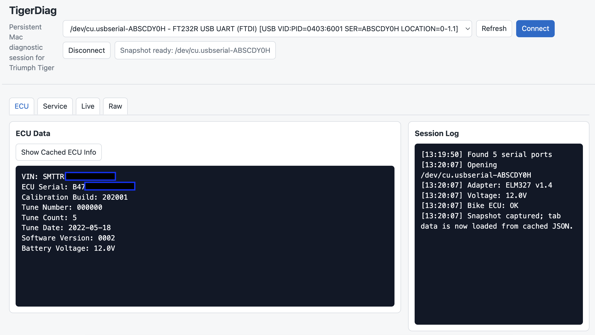
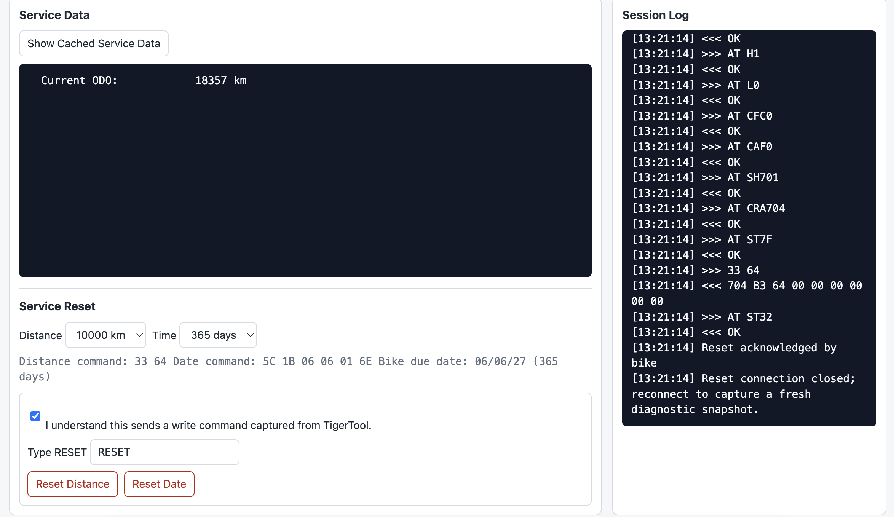
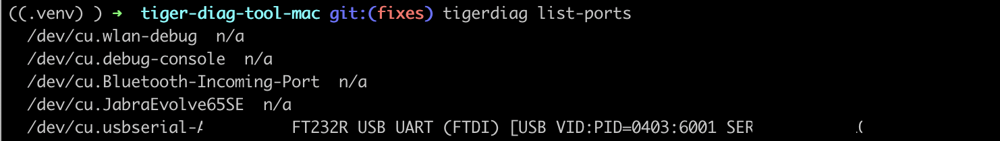
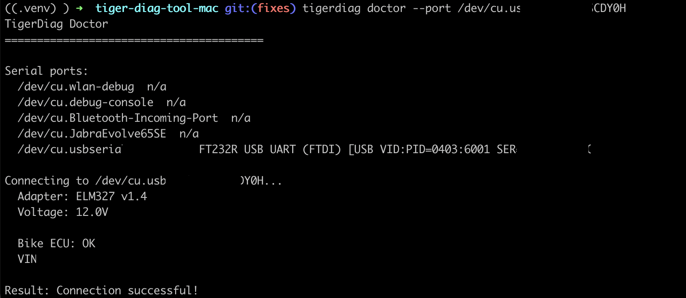
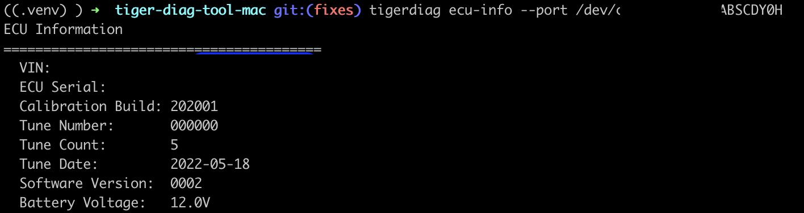
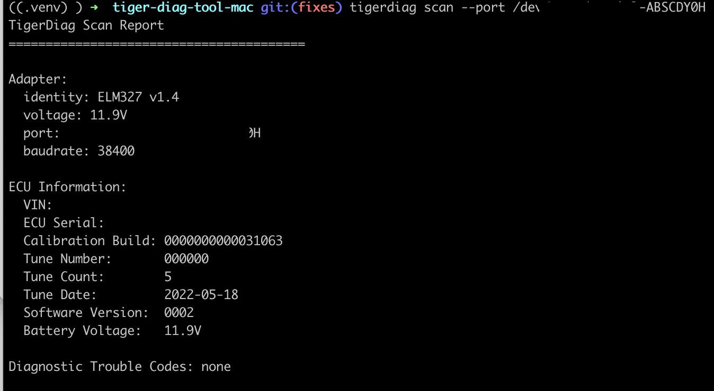

# TigerDiag v1.0.0

A macOS diagnostic tool for Triumph Tiger 900 GT Pro motorcycles. It provides a CLI and a lightweight local browser GUI using a BMDiag cable (FTDI FT232R, ELM327 v1.4) connected via USB hub.

## Features

**Currently Working:**
- ✅ Read VIN, ECU Serial, Calibration Build, Tune Number, Tune Count, Tune Date, Software Version
- ✅ Read battery voltage
- ✅ Full diagnostic scan with ECU information
- ✅ Auto-detect BMDiag/FTDI serial ports
- ✅ List available serial ports
- ✅ Lightweight local browser GUI
- ✅ Read odometer through the TigerTool 11-bit live-data path
- ✅ Captured TigerTool service distance/date reset commands, guarded behind explicit GUI safety confirmations

**In Development:**
- 🔄 Live sensor data (RPM, temperature, speed, throttle, gear, fuel level)
- 🔄 More service interval decoding
- 🔄 TES suspension module fault codes

**Not Yet Implemented:**
- ❌ ABS diagnostics
- ❌ TPMS diagnostics
- ❌ Throttle body balance check

## Release Notes: v1.0.0

TigerDiag v1.0.0 is the first working MVP for macOS. It provides:
- ECU connection health checks and VIN/ECU information reads
- a lightweight local browser GUI
- cached diagnostic snapshots after connect
- service distance reset with constrained TigerTool-style kilometre options
- service date reset with constrained TigerTool-style day options
- explicit reset safety controls and command previews
- separate start/stop live-data capture
- no arbitrary raw-command UI or CLI entry point

## Screenshots

### ECU Snapshot



### Service Reset



### CLI List Ports



### CLI Doctor



### CLI ECU Info



### CLI Scan



## Installation

### Requirements

- macOS 10.13+
- Python 3.9+
- BMDiag cable with FTDI FT232R chip (ELM327 v1.4)
- USB hub (direct USB-C adapter does not work with Mac mini)

### Setup

```bash
# Clone the repository
git clone https://github.com/sauravnz/tiger-diag-tool-mac.git
cd tiger-diag-tool-mac

# Create virtual environment
python3 -m venv .venv
source .venv/bin/activate

# Install in development mode
pip install -e .
```

## Quick Start

Use this sequence when you are at the bike.

1. Plug the BMDiag cable into the bike and the Mac.
2. Turn ignition ON. Engine does not need to be running for the basic checks.
3. Activate the virtual environment:

```bash
cd tiger-diag-tool-mac
source .venv/bin/activate
```

4. Check that the Mac can see the cable:

```bash
tigerdiag list-ports
```

Look for the FTDI/BMDiag port, usually similar to:

```text
/dev/cu.usbserial-XXXX  FT232R USB UART (FTDI)
```

5. Run the simplest connection diagnostic:

```bash
tigerdiag doctor --port /dev/cu.usbserial-XXXX
```

When the bike is connected and responding, you should see:

```text
Adapter: ELM327 v1.4
Voltage: 12.xV
Bike ECU: OK
VIN: SMT...
Result: Connection successful!
```

If the cable/adapter is found but the bike ECU is not responding, it will say:

```text
Bike ECU: NOT RESPONDING
VIN: not available
Result: Adapter connected, but the bike ECU is not responding.
```

That usually means ignition is OFF, the run/kill switch state is wrong, the OBD plug is not seated, or the wrong serial port was selected.

## GUI

Start the local browser GUI:

```bash
tigerdiag-gui
```

Then open the displayed local URL if the browser does not open automatically:

```text
http://127.0.0.1:8765/
```

The GUI has tabs for:
- **ECU:** read VIN and ECU information
- **Service:** read service data and run captured TigerTool reset commands
- **Live:** start/stop a separate live-data capture while the engine is running

When you click **Connect**, the GUI immediately captures a read-only diagnostic snapshot from the bike and stores it as in-memory JSON. The ECU and Service tabs display that cached snapshot. Switching tabs or pressing the "Show Cached..." buttons does not send more commands to the bike.

To refresh the data, click **Disconnect**, then **Connect** again.

Live data is separate because useful live frames require the engine to be running:

1. Click **Connect** with ignition ON.
2. Start the engine.
3. Open the **Live** tab and click **Start Live Capture**.
4. Watch frames update once per second.
5. Click **Stop Live Capture** before returning to normal diagnostics.

Stopping live capture restores the normal ECU diagnostic setup.

Service reset is intentionally guarded. The GUI only offers constrained values:
- distance: `1000` to `10000 km` in `1000 km` steps, default `10000 km`
- time: TigerTool-style day options, default `365 days`

The reset buttons require:
- the safety checkbox
- typing `RESET`
- a browser confirmation dialog

The GUI previews the exact command before reset. Confirmed examples from TigerTool captures:

```text
Distance 9000 km:  33 5A
Distance 10000 km: 33 64
Date 265 days, due 26/02/27: 5C 1B 02 1A 01 0A
```

For reset, the GUI closes the existing diagnostic session, opens a fresh serial connection, sends the captured TigerTool reset sequence, then closes that reset connection. Reconnect afterward to capture a fresh diagnostic snapshot.

## CLI Usage

### List Available Serial Ports

```bash
tigerdiag list-ports
```

### Check Connection Health

```bash
tigerdiag doctor --port /dev/cu.usbserial-XXXX
```

This is the best first command. It verifies:
- Mac can open the serial port
- ELM327 adapter responds
- adapter voltage can be read
- bike ECU responds to a VIN read

### Read VIN Only

```bash
tigerdiag vin --port /dev/cu.usbserial-XXXX
```

### Read ECU Information

```bash
tigerdiag ecu-info --port /dev/cu.usbserial-XXXX
tigerdiag ecu-info --port /dev/cu.usbserial-XXXX --json
```

### Full Diagnostic Scan

```bash
tigerdiag scan --port /dev/cu.usbserial-XXXX
tigerdiag scan --port /dev/cu.usbserial-XXXX --json
```

This is the simplest command for a short diagnostic report once `doctor` passes.

### Read Live Sensor Data

```bash
tigerdiag live --port /dev/cu.usbserial-XXXX --duration 10
```

### Read Service Interval Data

```bash
tigerdiag service --port /dev/cu.usbserial-XXXX
```

### CLI Screenshot Commands

These commands are useful for README or release screenshots. They are read-only.

```bash
# Show detected diagnostic cable/serial ports
clear
tigerdiag list-ports
```

```bash
# Show adapter voltage, ECU reachability, and VIN
clear
tigerdiag doctor --port /dev/cu.usbserial-XXXX
```

```bash
# Show VIN, ECU serial, calibration, tune, software, and voltage
clear
tigerdiag ecu-info --port /dev/cu.usbserial-XXXX
```

```bash
# Show the short all-in-one diagnostic report
clear
tigerdiag scan --port /dev/cu.usbserial-XXXX
```

## Technical Details

### Hardware Setup

The BMDiag cable requires a USB hub to be detected on Mac mini. Direct USB-C adapters do not work. The cable uses:
- **Chip:** FTDI FT232R (USB to serial)
- **Protocol:** ELM327 v1.4
- **Baud Rate:** 38400 bps
- **Connector:** 16-pin OBD-II

### CAN Bus Protocol

The Triumph Tiger 900 GT Pro uses ISO 15765-4 CAN with two main communication channels:

#### Engine ECU (29-bit CAN)
- **CAN Header:** DA D5 F1 (transmit), 18 DA F1 D5 (receive)
- **Protocol:** UDS Service 22 (Read Data By Identifier)
- **Baud Rate:** 500 kbps
- **DIDs Supported:**
  - F190: VIN (multi-frame ISO-TP response)
  - F18C: ECU Serial
  - F1A7: Calibration Build
  - F1A0: Tune Number
  - F1A2: Tune Count
  - F199: Tune Date (BCD encoded)
  - F1AE: Software Version

#### Instruments Module (29-bit CAN)
- **CAN Header:** DA C1 F1 (transmit), 18 DA F1 C1 (receive)
- **Protocol:** UDS Service 22 (Read Data By Identifier)
- **Status:** Partially documented
- **Known DIDs:** Service interval data (DIDs unknown, requires further investigation)

#### Live Data (11-bit CAN)
- **Protocol:** ATTP6 (ISO 15765-4 11-bit CAN 500 kbps)
- **Transmit:** CAN ID 701
- **Receive:** CAN ID 704 (query responses), 569 (broadcast data)
- **Query Commands:**
  - 0D 01: Read odometer (returns km in bytes 3-4)
  - 47 01: Read sensor frame 2 (purpose unknown)
  - 33 64: Captured TigerTool service distance reset payload, not a read command

### ISO-TP Multi-Frame Response Format

```
18 DA F1 D5 10 14 62 F1 90 53 4D 54   ← First frame (10 = first, 14 = total length)
18 DA F1 D5 21 54 52 45 36 34 44 38   ← Continuation frame 1 (21 = sequence 1)
18 DA F1 D5 22 4D 41 45 34 33 30 35   ← Continuation frame 2 (22 = sequence 2)
```

**Parsing:**
1. Skip CAN frame header (18 DA F1 D5)
2. Extract ISO-TP PCI byte (first byte of remaining data)
3. For first frame (PCI 0x10): skip PCI and length, extract data from byte 2 onwards
4. For continuation frames (PCI 0x2x): skip PCI, extract data from byte 1 onwards
5. Strip 0xAA padding bytes from end

### Critical Implementation Details

**Persistent Connection:** The entire diagnostic session must use ONE persistent serial connection. Opening and closing the connection between commands causes the ELM327 to lose its configuration (CAN header, flow control settings, etc.). This was the root cause of all previous failures.

**Initialization Sequence:** All commands must be sent in this exact order within the same session:
```
ATZ → ATE0 → ATH1 → ATV0 → ATL0 → ATCAF0 → ATCFC1 → ATCP18 → ATSH DA D5 F1 → ATTP7 → ATRV
```

**Flow Control:** ATCFC1 (CAN Flow Control ON) is critical for receiving multi-frame ISO-TP responses. Without it, only the first frame is received.

## Architecture

### Core Modules

**connection.py:** Persistent serial connection to ELM327 adapter. Handles:
- Opening/closing serial port
- Sending AT commands and UDS commands
- Reading responses (including multi-frame ISO-TP)
- Triumph-specific CAN initialization

**diagnostics.py:** ECU data reading. Implements:
- UDS Service 22 (Read Data By Identifier)
- Multi-frame ISO-TP response parsing
- ECU information extraction (VIN, serial, calibration, etc.)

**live_data.py:** Real-time sensor data reading. Implements:
- 11-bit CAN protocol setup
- Live data query commands
- Sensor data parsing and formatting

**service_interval.py:** Service interval and instruments module support. Implements:
- Service interval data reading
- Exact captured TigerTool reset helpers for distance/date, used only behind GUI safety confirmations
- Instruments module communication

**gui.py:** Local browser GUI. Implements:
- Persistent connection shared by all GUI tabs
- ECU, service, and live-data views
- Safety gating for captured service reset commands

**ports.py:** Serial port detection for macOS. Auto-detects FTDI/ELM327 ports.

**cli.py:** Command-line interface with subcommands:
- list-ports, doctor, scan, vin, ecu-info, live, service

## Known Limitations

1. **TES Suspension Fault:** The TES (Triumph Electronic Suspension) fault is stored in a separate suspension module, not the main engine ECU. The CAN address for this module has not yet been identified.

2. **Service Reset:** Distance and date reset are implemented in the GUI with constrained TigerTool-style values and explicit safety confirmations.

3. **Live Data Decoding:** The raw CAN frames from live data (704 and 569) have been partially decoded. The odometer is confirmed (0D 01 query), but other sensor values (RPM, temperature, speed, etc.) require further analysis.

4. **ABS/TPMS:** These modules are not yet supported.

## Testing

### Test Scripts

Three standalone test scripts are provided for development:

```bash
# Test VIN reading with persistent connection
python3 test_vin_read.py /dev/cu.usbserial-XXXX

# Test live data reading
python3 test_live_data.py /dev/cu.usbserial-XXXX

# Passive CAN bus scanning
python3 test_can_scan.py /dev/cu.usbserial-XXXX 10
```

## Contributing

This is a diagnostic interoperability project. If you have:
- verified Triumph diagnostic protocol information
- Information about TES suspension module CAN address
- Live data byte decoding information
- Other Triumph diagnostic protocol details

Please open an issue or contact the maintainers.

## Disclaimer

This tool communicates with your motorcycle's ECU. It performs read operations by default. Service reset writes are available only through exact captured TigerTool payloads and explicit GUI safety confirmations. Use at your own risk. The author is not responsible for any damage to your bike or its systems.

## License

MIT License - See LICENSE file for details

## References

- [ELM327 Datasheet](https://www.elmelectronics.com/DSheets/ELM327DS.pdf)
- [ISO 14229-1 (UDS)](https://en.wikipedia.org/wiki/Unified_Diagnostic_Services)
- [ISO 15765-4 (CAN ISO-TP)](https://en.wikipedia.org/wiki/ISO_15765-2)
- [TigerTool Forum](https://www.tiger800.co.uk/)
- [Triumph Tiger Explorer Forum](https://www.tiger-explorer.com/)

## Acknowledgments

- T800XC (TigerTool author) for pioneering Triumph diagnostic tool development
- Triumph Tiger community forums for technical discussions
- BMDiag for the diagnostic cable hardware, which was purchased and used for testing
